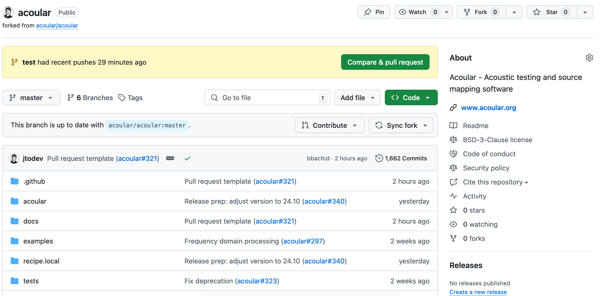
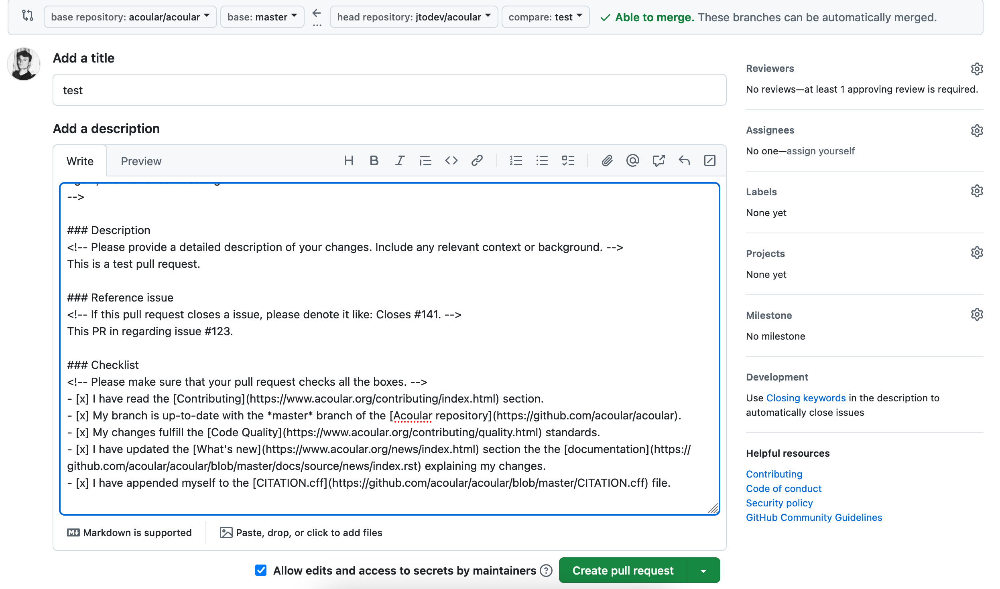
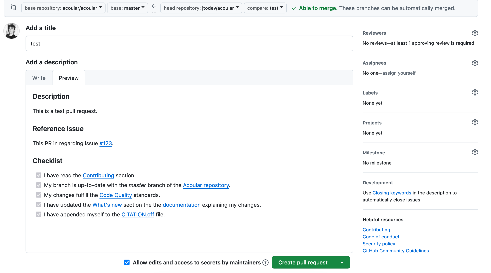

.. _Submitting a pull request:

Submitting a Pull Request
=========================

Preparing a branch
------------------

Before opening a pull request, sync your fork's ``master`` branch with the upstream `Acoular repository <https://github.com/acoular/acoular>`_. GitHub documents how to `sync a fork <https://docs.github.com/en/pull-requests/collaborating-with-pull-requests/working-with-forks/syncing-a-fork>`_. Then create a branch for your changes:

.. code-block:: console

   $ git switch -c new-branch

Run the :doc:`quality` checks, commit your changes, and push the branch:

.. code-block:: console

   $ git push --set-upstream origin new-branch

Creating a pull request on GitHub
---------------------------------

Open your fork on GitHub and select **Contribute** or **Compare & pull request** for the branch.

Describe the change, link the related issue when applicable, and complete the pull request template.

Use the **Preview** tab to review the rendered description before selecting **Create pull request**.

